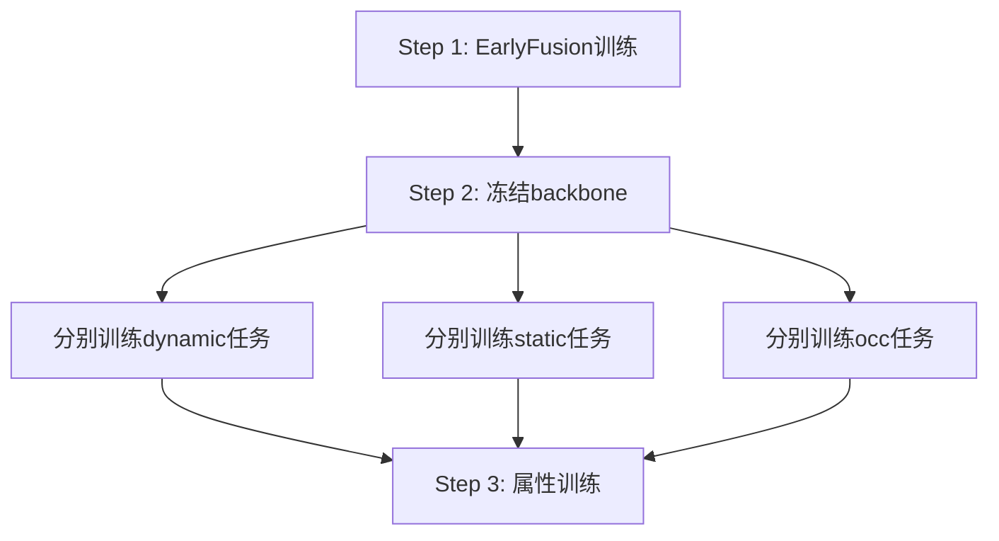
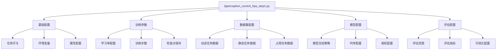

# projects/perception/configs/lpperception_current_hpa_step1.py 详细分析

## 📋 文件概览

`lpperception_current_hpa_step1.py` 是LeapAI框架perception项目的核心配置文件，定义了多任务感知训练的第一阶段配置。该文件包含了完整的训练参数、数据集配置、模型设置和优化策略。

**文件路径**: [`projects/perception/configs/lpperception_current_hpa_step1.py`](../projects/perception/configs/lpperception_current_hpa_step1.py)  
**文件大小**: 496行  
**配置版本**: lphpa v3.0 step1  

## 🎯 配置目标

### 主要特性
1. **HPA开启lidar**: 启用激光雷达数据融合
2. **窄角切到原图**: 所有HPA数据窄角切到原图
3. **增加无人二轮车与barrier输出**: 扩展目标检测类别
4. **多阶段训练**: 先训练单帧earlyfusion，再分别训练各任务

### 训练流程


## 🔧 核心配置分析

### 1. 基础配置 (第1-48行)

#### 环境和任务开关
```python
# 环境变量
ENV_ONNX = eval(os.environ.get("ONNX", "False"))

# 任务标识
job_name = "lphpa_v3.0_step1"
enable_lidar = True                    # 启用LiDAR
use_dynamic_outputs = True             # 使用动态输出
dynamic_task = True                    # 启用动态任务
static_task = True                     # 启用静态任务
occ_task = False                       # 关闭占用任务
attr_task = False                      # 关闭属性任务
```

#### 时序和优化配置
```python
# 时序处理开关
enable_dynamic_temporal = False        # 动态任务时序
enable_static_temporal = False         # 静态任务时序
enable_occ_temporal = False            # 占用任务时序
enable_static_querylane = False        # 静态查询车道

# 优化配置
use_backbone_amp = True                # Backbone混合精度
eval_with_visualize = False            # 评估时可视化
eval_instance = False                  # 实例评估
with_virtual_narrow = False            # 虚拟窄角
```

#### 属性任务配置
```python
attr_heads_switch = dict(
    stationary_car=True,               # 静止车辆
    beyond_barrier_obj=True,           # 超越障碍物
    car_door=True,                     # 车门
    static_to_cutin=False,             # 静态切入
)

attr_config = dict(
    attr_branch_cfg=[],                 # 属性分支配置
    only_train_attr=attr_training_freeze_dynamic,
    merge_car_door_loss=True,          # 合并车门损失
    loss_attr={},                      # 属性损失
    attr_param={},                     # 属性参数
)
```

### 2. 训练参数配置 (第50-94行)

#### 基础训练参数
```python
# 训练间隔和GPU配置
interval_by = "step"
num_gpus = int(os.environ["RCNUM"]) * int(os.environ["GPU_NUM"])
batch_size = 16

# 数据集长度和训练步数
mini_dataset_length_ = num_gpus * batch_size * 6
num_train_cases = 200000               # 训练样本数
num_finetune_cases = 0                 # 微调样本数

# 步数计算
train_steps = num_train_cases * 100 // (num_gpus * batch_size)
finetune_steps = num_finetune_cases * 100 // (num_gpus * batch_size)
max_steps = train_steps + finetune_steps
warmup_steps = 500                     # 预热步数
```

#### 检查点保存策略
```python
save_ckpt_interval = 500               # 保存间隔
if train_steps == 0 or finetune_steps == 0:
    save_ckpt_steps = list(range(0, max_steps, save_ckpt_interval))[-3:]
else:
    save_ckpt_steps = [train_steps] + list(
        range(0, max_steps, save_ckpt_interval)
    )[-2:]
```

#### 学习率和损失权重
```python
# 学习率配置 (根据GPU数量自适应)
float_lr = 2e-4 * math.sqrt(num_gpus / 8)
finetune_lr = 2e-4 * math.sqrt(num_gpus / 8)

# 损失权重配置
dynamic_loss_weight = 1.25 if enable_dynamic_temporal else 2.5
static_loss_weight = 1.0 if enable_static_temporal else 0.67
task_loss_weights = {
    "dynamic": dynamic_loss_weight,
    "static": static_loss_weight,
    "occ": 1.0,
}
```

#### 预训练模型
```python
float_pretrain = "/dahuafs/groupdata/share/perception/release/v4.11/torch/v4.11.ckpt"
```

### 3. 数据集配置 (第95-333行)

#### 数据集路径
```python
# 训练数据集路径
dynamic_train_set_dir = "/dahuafs/groupdata/Cameraalgorithm/hpa_perception/BEV_Dynamic_target/251001"
static_train_set_dir = "/dahuafs/groupdata/bev_perception/BEV_Static_map/train_v2.0/v2.8/8650/earlyfusion_v1"

# 验证数据集路径
dynamic_val_set_dir = "/dahuafs/groupdata/Cameraalgorithm/hpa_perception/BEV_Dynamic_target/251001"
static_val_set_dir = "/dahuafs/groupdata/bev_perception/BEV_Static_map/test_v2.0/earlyfusion_v1"

train_sample_mode = "online"            # 采样模式
```

#### Debug模式配置
```python
my_debug = os.environ.get("my_debug", None)
if my_debug == "yes":
    # Debug配置 - 小数据集快速测试
    mini_dataset_length = {"dynamic": 8, "static": 8, "occ": 8}
    batch_sizes = {
        "dynamic": {"train": 1, "val": 1},
        "static": {"train": 2, "val": 1},
        "occ": {"train": 1, "val": 1},
    }
    # 验证时增大下采样率提高debug速度
    down_sample_ratio = {
        "dynamic": {"train": 1, "val": 10},
        "static": {"train": 1, "val": 10},
        "occ": {"train": 1, "val": 1},
    }
```

#### 动态任务数据配置
```python
if dynamic_task:
    train_set_info_path["dynamic"] = {
        "online": [
            # EE3.5 HPA数据
            os.path.join(dynamic_train_set_dir,"train_list_EE30_hpa_2587.txt"),
            os.path.join(dynamic_train_set_dir,"train_list_EE30_hpa_3209.txt"),
            os.path.join(dynamic_train_set_dir,"train_list_EE35_hpa_2767.txt"),
            os.path.join(dynamic_train_set_dir,"train_list_EE35_hpa_430.txt"),
            
            # 特殊场景数据
            os.path.join(dynamic_train_set_dir,"Train_HPA_ZhangAiWuChe_127.txt"),
            os.path.join(dynamic_train_set_dir,"train_list_ground_static2dynamic_65.txt"),
            
            # 近处行人数据
            os.path.join(dynamic_train_set_dir,"train_list_EE35_hpa_person_4m.txt"),
            os.path.join(dynamic_train_set_dir,"train_list_EE30_hpa_person4.txt"),
            
            # 近处非机动车数据
            os.path.join(dynamic_train_set_dir,"train_list_EE30_hpa_non_motor.txt"),
            
            # 地库卡车数据
            os.path.join(dynamic_train_set_dir,"train_list_EE30_hpa_truck.txt"),
            os.path.join(dynamic_train_set_dir,"train_list_EE35_hpa_truck.txt"),
            
            # 大型车辆数据
            os.path.join(dynamic_train_set_dir,"train_list_EE35_drive_large_car_900.txt"),
            
            # 地库上下坡数据
            os.path.join(dynamic_train_set_dir,"train_list_EE35_hpa_ud.txt"),
            os.path.join(dynamic_train_set_dir,"train_list_EE30_hpa_ud.txt"),
            
            # HPA动态JSON数据
            os.path.join(dynamic_train_set_dir,"HPA_dynamic_json.txt"),
        ],
        "offline": "",
        "lmdb_path": os.path.join(dynamic_train_set_dir,"train_lmdb.txt"),
    }
```

#### 静态任务数据配置
```python
if static_task:
    train_set_info_path["static"] = {
        "online": [
            "/dahuafs/groupdata/share/perception/dataset/Static_HPA/20251114/BEVStatic_HPA_Parking-mask_2168069_train.txt",
            "/dahuafs/groupdata/share/perception/dataset/Static_HPA/20251117/BEVStatic_HPA_Parking-mask_2213523_216.txt",
            "/dahuafs/groupdata/share/perception/dataset/Static_HPA/20251122/BEVStatic_Train_HPA_Parking_2253976_288.txt",
        ],
        "offline": "",
        "lmdb_path": "/dahuafs/groupdata/Cameraalgorithm/tmp/szh/code_Git_2025_07/leapnet_March/lmdb_1783288.txt",
    }
```

#### 多任务配置映射
```python
multi_task_config = {
    "dynamic": f"projects/perception/dynamic{onnx_suffix}.py",
    "static": f"projects/perception/static{onnx_suffix}.py",
    "occ": f"projects/perception/occ{onnx_suffix}.py",
}
```

### 4. 模型冻结策略 (第335-354行)

#### 分层冻结配置
```python
freeze_module_schedules = {
    "stage1_backbone0": train_steps,    # Backbone第0层
    "stage1_backbone1": train_steps,    # Backbone第1层
    "stage1_backbone2": train_steps,    # Backbone第2层
    "stage1_backbone3": train_steps,    # Backbone第3层
    "stage1_neck0": train_steps,        # Neck第0层
    "stage1_neck1": train_steps,        # Neck第1层
    "stage1_neck2": train_steps,        # Neck第2层
    "stage1_neck3": train_steps,        # Neck第3层
    "view_transfer": train_steps,        # 视图变换模块
}

# LiDAR相关模块冻结
if enable_lidar:
    freeze_module_schedules.update({
        "lidar_vfe": train_steps,           # LiDAR特征提取
        "lidar_middle_encoder": train_steps, # LiDAR中间编码器
        "lidar_bev_backbone": train_steps,  # LiDAR BEV主干
        "fuser": train_steps,               # 特征融合器
    })
```

### 5. 时序配置 (第356-369行)

#### 静态任务时序配置
```python
static_temporal_config = dict(
    enable_temporal=enable_static_temporal,
    fusion_conv="VGGBlock",              # 融合卷积类型
    grid_sample_mode="nearest",           # 网格采样模式
    visualize_interval=8888,              # 可视化间隔
    debug_dir=None,                       # 调试目录
)

static_temporal_sample_cfg = dict(
    mode="sample_by_timestamp",           # 按时间戳采样
    intervals=[0.7, 1.9, 3.3],          # 时间间隔
    match_tol=0.1,                       # 匹配容差
    interval_variable=False,              # 可变间隔
    max_capacity=40,                     # 最大容量
)
```

### 6. 数据处理配置 (第371-496行)

#### 数据分割和采样
```python
# 使用rank分割
use_rank_split = {
    "dynamic": True,
    "static": True,
    "occ": True,
}

# LiDAR点云处理参数
num_point_features = 4                    # 点特征数量
max_number_of_voxels = 20000             # 最大体素数量
max_points_per_voxel = 48                # 每个体素最大点数
```

#### 感知范围配置
```python
lidar_range = {
    # [x_min, y_min, z_min, x_max, y_max, z_max]
    "dynamic": [-40, -44.8, -3.0, 62.4, 44.8, 5.0],
    "static": [-20.8, -22.4, -3.0, 62.4, 22.4, 5.0],
    "occ": [0.0, -20.0, -1.0, 65.6, 20.0, 3.0],
}
```

#### 静态任务评估配置
```python
static_series_eval = True                 # 系列评估
series_dis_thresh = 0.25                 # 距离阈值
series_eval_conf = [0.9, 0.85, 0.8, 0.75, 0.7]  # 评估置信度

# 子类别配置
series_sub_cls = {
    "lanes": {
        "_marking_type/lane": [
            "Other", "SolidLine", "DoubleSolidLine", "DashedLine",
            "DoubleDashedLine", "RightSolidLeftDashed", "LeftSolidRightDashed",
            "WideSolidLine", "WideDashedLine", "ShortDashedLine",
        ],
    },
}

# 评估范围配置
series_eval_range = {
    "all_range": [-44.8, 44.8, -20.0, 120.0],
    "main_range": [-8.0, 8.0, -20.0, 120.0],
    "main_near_range": [-8.0, 8.0, 0.0, 30.0],
    "main_middle_range": [-8.0, 8.0, 30.0, 60.0],
    "main_far_range": [-8.0, 8.0, 60.0, 120.0],
}
```

#### BEV和GT尺寸配置
```python
# BEV特征图尺寸
bev_hw = {
    "dynamic": (112, 128),
    "static": (56, 104),
    "dynamic_AT": (112, 140),
    "occ": (112, 140),
}

# Ground Truth尺寸
dynamic_gt_hw = [448, 512]
static_gt_hw = [224, 416]
```

#### 流式处理和采样配置
```python
# 流式处理开关
use_streaming = {
    "dynamic": enable_dynamic_temporal,
    "static": enable_static_temporal,
    "occ": enable_occ_temporal,
}

# 最大采样数
max_samples = {
    "dynamic": 100,
    "static": 100,
    "occ": 100,
}

# 数据加载器工作进程
num_workers = {
    "dynamic": {"train": 4, "val": 4},
    "static": {"train": 4, "val": 4},
    "occ": {"train": 4, "val": 4},
}
```

#### 学习率分组配置
```python
group_lr_scale = {
    "stage1_backbone": 1.0,
    "stage1_neck": 1.0,
}
```

#### 相机配置
```python
# 虚拟窄角配置
if not with_virtual_narrow:
    wrong_front_narrow_caseID_txt = "/dahuafs/groupdata/share/perception/dataset/Static/front_narrow_wrong_case/front_narrow_wrong_case.txt"
    virtual_narrow_name = "front_narrow"
else:
    wrong_front_narrow_caseID_txt = None
    virtual_narrow_name = "virtual_narrow"

# 错误案例文件
unused_case_files_txt = "/dahuafs/groupdata/share/perception/dataset/Static/20250815/static_lmdb_error.txt"

# 相机组配置
camera_groups = {
    "group1": [virtual_narrow_name],
    "group2": ["front_wide"],
    "group3": ["back"],
    "group4": ["front_left", "back_left", "front_right", "back_right"],
}

# 视图优先级
view_priory = [
    virtual_narrow_name, "back", "front_left", "front_right",
    "front_wide", "back_left", "back_right",
]
```

#### 训练和设备配置
```python
log_every_n_steps = 10                   # 日志记录间隔
devices_id = "auto"                      # GPU设备ID

# 精度模式选项
# "32": 全部float32
# "16-mixed": weight为float32，其他为float16
# "bf16-mixed": weight为float32，其他为bfloat16
# "16-true": 全部float16
# "bf16-true": 全部bfloat16
# "64-true": 全部float64

accumulate_grad_batches = 1               # 梯度累积批次数
# profiler = "simple"                    # 性能分析器
```

## 🎯 关键设计特点

### 1. 多阶段训练策略
- **Step 1**: EarlyFusion训练 (dynamic + static + img + lidar)
- **Step 2**: 冻结backbone，分别训练各任务
- **Step 3**: 在dynamic基础上训练属性模块

### 2. 数据增强策略
- **多场景数据**: 包含EE3.5、地库、上下坡等多种场景
- **特殊目标**: 重点关注行人、非机动车、卡车等
- **数据平衡**: 通过重复采样平衡不同类别

### 3. 模型冻结机制
- **分层冻结**: Backbone和Neck分层冻结
- **LiDAR模块**: VFE、编码器、BEV主干等模块冻结
- **视图变换**: view_transfer模块冻结

### 4. 评估策略
- **多范围评估**: 不同距离范围的评估
- **多置信度**: 多个置信度阈值的评估
- **子类别评估**: 车道线等细粒度类别评估

## 📊 配置参数总结

### 训练参数
| 参数 | 值 | 说明 |
|------|-----|------|
| batch_size | 16 | 批大小 |
| num_train_cases | 200000 | 训练样本数 |
| train_steps | 计算得出 | 训练步数 |
| float_lr | 2e-4 * sqrt(gpus/8) | 学习率 |
| warmup_steps | 500 | 预热步数 |

### 任务配置
| 任务 | 状态 | 说明 |
|------|------|------|
| dynamic | True | 动态感知任务 |
| static | True | 静态感知任务 |
| occ | False | 占用网络任务 |
| attr | False | 属性任务 |

### 数据配置
| 配置项 | 值 | 说明 |
|--------|-----|------|
| enable_lidar | True | 启用LiDAR |
| train_sample_mode | "online" | 在线采样 |
| use_rank_split | True | 使用rank分割 |

## 🔧 配置使用指南

### 1. 环境变量设置
```bash
export ONNX=False
export RCNUM=1
export GPU_NUM=8
export my_debug=no
```

### 2. 修改训练参数
```python
# 修改批大小
batch_size = 8

# 修改学习率
float_lr = 1e-4

# 启用/禁用任务
dynamic_task = True
static_task = True
occ_task = False
attr_task = False
```

### 3. 数据集路径配置
```python
# 修改数据集路径
dynamic_train_set_dir = "/path/to/dynamic/train"
static_train_set_dir = "/path/to/static/train"

# 添加新的训练列表
train_set_info_path["dynamic"]["online"].append("/path/to/new_data.txt")
```

### 4. 模型冻结配置
```python
# 修改冻结策略
freeze_module_schedules = {
    "stage1_backbone0": train_steps // 2,  # 提前解冻
    "stage1_neck0": train_steps // 2,
}
```

## 🚀 实践建议

### 1. 调试模式
设置环境变量启用调试模式：
```bash
export my_debug=yes
```
这将使用小数据集进行快速测试。

### 2. 性能优化
- 根据GPU数量调整学习率
- 使用混合精度训练加速
- 合理设置数据加载器工作进程数

### 3. 数据平衡
- 根据实际需求调整各类数据的重复次数
- 监控各类别的训练效果
- 适时调整损失权重

### 4. 模型调优
- 根据验证集表现调整冻结策略
- 实验不同的学习率调度
- 优化损失函数权重

## 📈 配置文件结构图



## 🔍 关键配置解析

### 1. 多任务损失权重
```python
task_loss_weights = {
    "dynamic": 2.5,      # 动态任务权重较高
    "static": 0.67,       # 静态任务权重较低
    "occ": 1.0,          # 占用任务标准权重
}
```

### 2. 自适应学习率
```python
# 根据GPU数量自适应调整学习率
float_lr = 2e-4 * math.sqrt(num_gpus / 8)
```

### 3. 分层数据增强
- **动态任务**: 包含多种特殊场景
- **静态任务**: 重点关注停车场场景
- **数据平衡**: 通过重复采样平衡各类别

### 4. 灵活的评估策略
- **多范围评估**: 不同距离范围的性能评估
- **多置信度**: 多个置信度阈值的评估
- **细粒度评估**: 子类别的详细评估

## 📝 配置最佳实践

### 1. 环境配置
- 合理设置GPU数量和批大小
- 根据硬件资源调整工作进程数
- 使用适当的数据加载策略

### 2. 训练策略
- 采用多阶段训练提高效果
- 合理设置模型冻结策略
- 使用学习率预热和衰减

### 3. 数据管理
- 确保数据路径正确
- 合理配置数据增强
- 监控数据质量和平衡性

### 4. 模型优化
- 根据任务特点调整损失权重
- 使用混合精度训练
- 合理设置检查点保存策略

## 🎯 总结

`lpperception_current_hpa_step1.py` 是一个功能完整、配置灵活的多任务感知训练配置文件。它具有以下特点：

### ✅ 优势
1. **多任务支持**: 原生支持动态、静态、占用等多种感知任务
2. **灵活配置**: 支持多种训练策略和参数调整
3. **数据丰富**: 包含多种场景和类别的训练数据
4. **评估完善**: 提供多维度、多层次的评估策略
5. **性能优化**: 支持混合精度、梯度累积等优化技术

### 🔧 核心机制
1. **分阶段训练**: 先训练融合模型，再分别优化各任务
2. **模型冻结**: 策略性冻结不同模块提高训练稳定性
3. **数据平衡**: 通过重复采样平衡不同类别数据
4. **自适应学习率**: 根据硬件配置自动调整学习率

### 📚 学习价值
通过深入理解这个配置文件，可以掌握：
- 大规模多任务感知训练的配置方法
- 复杂数据集的管理和配置策略
- 模型训练的优化技巧和最佳实践
- 评估体系的构建和调优方法

这个配置文件为理解和实践工业级感知系统训练提供了优秀的参考模板。
