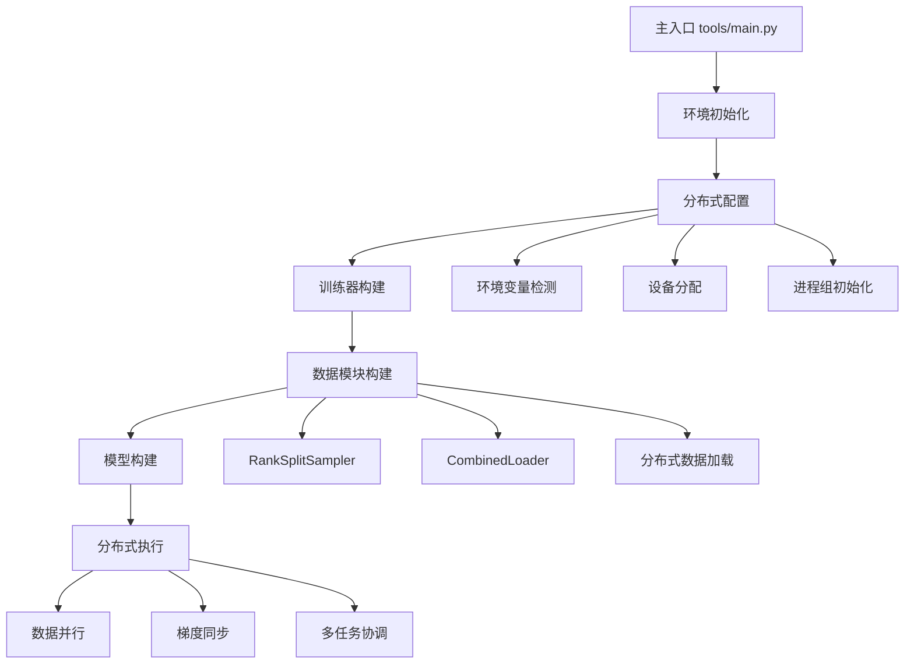
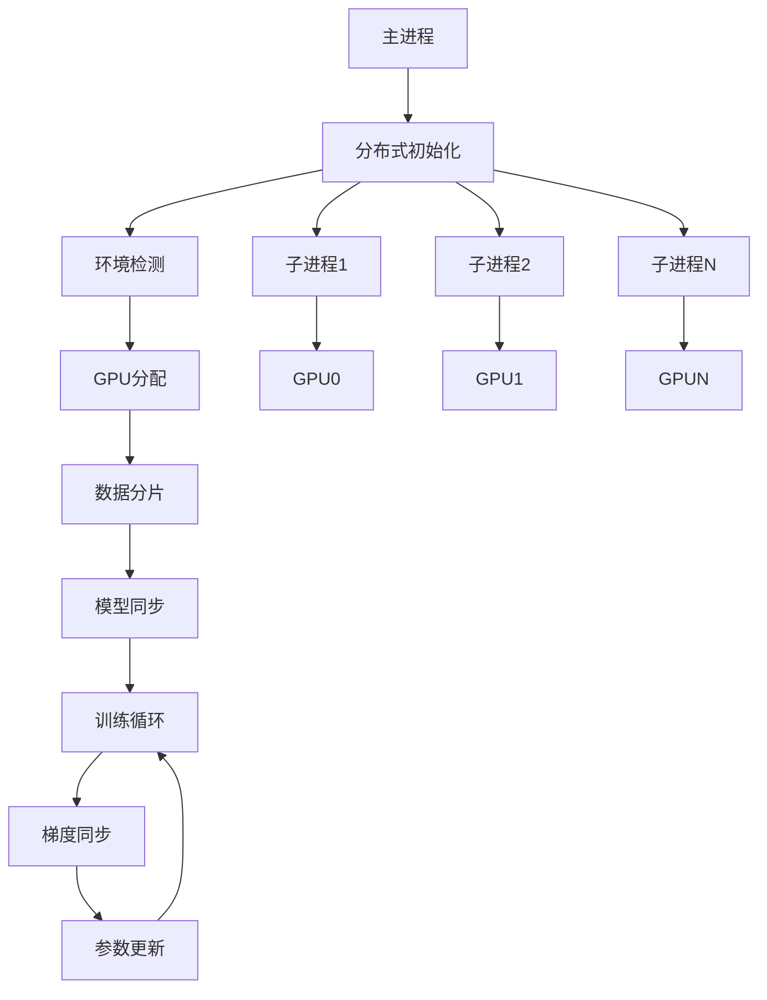

# LeapAI分布式训练和部署机制详细分析

## 📋 学习概览

本文档详细分析LeapAI框架的分布式训练和部署机制，包括分布式环境管理、数据并行、模型并行、多任务协调等核心功能。

## 🎯 核心组件分析

### 1. 分布式环境管理 - [`leapai/distributed.py`](../leapai/distributed.py)

#### 1.1 装饰器函数

##### rank_zero_only装饰器 (第9-15行)
```python
def rank_zero_only(fn):
    @wraps(fn)
    def inner(*args, **kwargs):
        if int(os.environ.get("LOCAL_RANK", -100)) in [-100, 0]:
            return fn(*args, **kwargs)
    return inner
```

**功能特点**:
- **本地秩限制**: 只在本地秩为0或-100时执行函数
- **日志控制**: 用于控制日志输出，避免多进程重复输出
- **环境变量**: 通过LOCAL_RANK环境变量获取进程秩
- **默认值**: -100表示非分布式环境

##### global_rank_zero_only装饰器 (第44-51行)
```python
def global_rank_zero_only(fn):
    @wraps(fn)
    def inner(*args, **kwargs):
        grank, _ = get_dist_info()
        if grank == 0:
            return fn(*args, **kwargs)
    return inner
```

**功能特点**:
- **全局秩限制**: 只在全局秩为0时执行函数
- **分布式感知**: 通过get_dist_info获取分布式信息
- **主进程控制**: 确保只有主进程执行特定操作

#### 1.2 设备管理

##### get_current_device函数 (第18-24行)
```python
def get_current_device():
    if torch.cuda.is_available():
        cuda_id = os.environ.get("LOCAL_RANK", 0)
        device = torch.device(f"cuda:{cuda_id}")
    else:
        device = torch.device("cpu")
    return device
```

**设备选择逻辑**:
- **CUDA可用**: 使用LOCAL_RANK指定的GPU
- **CUDA不可用**: 回退到CPU
- **自动分配**: 根据进程秩自动分配GPU设备

#### 1.3 分布式状态管理

##### dist_init函数 (第27-31行)
```python
def dist_init():
    initialized = False
    if dist.is_available():
        initialized = dist.is_initialized()
    return initialized
```

**状态检查**:
- **可用性检查**: 检查分布式是否可用
- **初始化检查**: 检查分布式是否已初始化
- **返回状态**: 返回初始化状态

##### get_dist_info函数 (第34-41行)
```python
def get_dist_info(process_group=None) -> Tuple[int, int]:
    if dist_init():
        global_rank = dist.get_rank(process_group)
        world_size = dist.get_world_size(process_group)
    else:
        global_rank = 0
        world_size = 1
    return global_rank, world_size
```

**信息获取**:
- **分布式环境**: 获取全局秩和世界大小
- **单机环境**: 返回秩0和世界大小1
- **进程组支持**: 支持指定进程组

#### 1.4 GPU资源管理

##### reset_gpu函数 (第54-57行)
```python
def reset_gpu():
    torch.cuda.empty_cache()
    torch.cuda.synchronize()
    torch.cuda.init()
```

**重置操作**:
- **清空缓存**: 释放GPU内存缓存
- **同步操作**: 等待所有GPU操作完成
- **重新初始化**: 重新初始化CUDA

### 2. 环境信息收集 - [`leapai/env.py`](../leapai/env.py)

#### 2.1 collect_env函数 (第11-104行)

##### 系统信息收集
```python
env_info = {}
env_info["sys.platform"] = sys.platform
env_info["Python"] = sys.version.replace("\n", "")
```

##### CUDA环境检测
```python
cuda_available = torch.cuda.is_available()
env_info["CUDA available"] = cuda_available

if cuda_available:
    devices = defaultdict(list)
    for k in range(torch.cuda.device_count()):
        devices[torch.cuda.get_device_name(k)].append(str(k))
    for name, device_ids in devices.items():
        env_info["GPU " + ",".join(device_ids)] = name
```

**GPU信息收集**:
- **设备检测**: 检测所有可用GPU设备
- **设备分组**: 按设备名称分组GPU
- **详细信息**: 记录每个GPU的型号和ID

##### 编译器信息
```python
try:
    import sysconfig
    cc = sysconfig.get_config_var("CC")
    if cc:
        cc_info = subprocess.check_output(f"{cc} --version", shell=True)
        env_info["GCC"] = cc_info.decode("utf-8").partition("\n")[0].strip()
```

**编译器检测**:
- **GCC检测**: 检测GCC编译器版本
- **MSVC检测**: Windows下检测MSVC版本
- **错误处理**: 编译器不可用时标记为"n/a"

### 3. 分布式数据采样 - [`leapai/data/sampler/rank_split_sampler.py`](../leapai/data/sampler/rank_split_sampler.py)

#### 3.1 RankSplitSampler类 (第15-151行)

##### 核心特性
```python
@LEAP_OBJECTS.register_module()
class RankSplitSampler(DistributedSampler[T_co]):
    """
    Distributed sampler that supports user-defined indices.
    """
```

**设计特点**:
- **继承DistributedSampler**: 基于PyTorch分布式采样器
- **索引控制**: 支持用户定义的索引范围
- **下采样**: 支持数据下采样
- **流式处理**: 支持流式数据加载

##### 初始化参数 (第43-82行)
```python
def __init__(
    self,
    dataset: ConcatDataset,
    left_index: int,
    right_index: int,
    rank_sample: int,
    down_sample_ratio: int = 1,
    use_streaming: bool = False,
    batch_size: int = None,
    *,
    num_replicas: Optional[int] = None,
    rank: Optional[int] = None,
    shuffle: bool = True,
    seed: int = 0,
    drop_last: bool = False,
) -> None:
```

**参数说明**:
- **dataset**: ConcatDataset类型的数据集
- **left_index/right_index**: 索引范围控制
- **rank_sample**: 每个秩的样本数
- **down_sample_ratio**: 下采样比例
- **use_streaming**: 是否启用流式处理
- **batch_size**: 批次大小（流式处理时必需）

##### 索引生成策略 (第84-128行)
```python
def get_epoch_indices(self):
    final_indices = []
    last_length = 0
    dataset_num = len(self.dataset.datasets)
    dataset_indices = {}
    
    # 为每个数据集生成索引
    for i in range(dataset_num):
        dataset = self.dataset.datasets[i]
        length = len(dataset)
        indices = list(range(last_length, last_length + length))
        if i == 0:
            indices = indices[self.left_index :]
        if i == dataset_num - 1:
            indices = indices[: self.right_index + 1]
        if self.shuffle and not self.use_streaming:
            indices = self.shuffle_indices(indices)
        indices = indices[:: self.down_sample_ratio]
        dataset_indices[i] = indices
        last_length += length
```

**索引生成逻辑**:
1. **范围控制**: 根据left_index和right_index截取索引
2. **随机打乱**: 非流式模式下随机打乱索引
3. **下采样**: 按比例下采样索引
4. **数据集管理**: 管理多个数据集的索引

##### 流式处理逻辑 (第104-121行)
```python
if self.use_streaming:
    for start in range(0, dataset_num, self.batch_size):
        tmp = dataset_idx[start : start + self.batch_size]
        while tmp:
            for set_i in tmp:
                indices = dataset_indices[set_i]
                if len(indices) > 0:
                    final_indices.append(indices.pop(0))
                else:
                    tmp.remove(set_i)
```

**流式处理特点**:
- **批次处理**: 按批次处理数据集
- **轮询机制**: 轮询各个数据集
- **动态调整**: 数据集耗尽时动态调整

#### 3.2 RankSplitCaseSampler类 (第154-175行)

##### 用途和设计
```python
@LEAP_OBJECTS.register_module()
class RankSplitCaseSampler(DistributedSampler[T_co]):
    """
    must split case data into ranks in DataModule.
    this sampler just work as batched SequenceSampler
    just for testing now
    """
```

**设计特点**:
- **案例采样**: 专门用于案例数据的采样
- **批次序列**: 按批次顺序采样
- **测试用途**: 主要用于测试场景

### 4. 组合数据加载器 - [`leapai/data/dataloader/combined_dataloader.py`](../leapai/data/dataloader/combined_dataloader.py)

#### 4.1 BaseCombinedLoader类 (第10-17行)

##### 时间统计功能
```python
@LEAP_OBJECTS.register_module()
class BaseCombinedLoader(CombinedLoader):
    def __next__(self) -> _ITERATOR_RETURN:
        start = time.monotonic()
        batch, batch_id, dataloader_id = super().__next__()
        end = time.monotonic()
        batch["_data_time_cost"] = end - start
        return batch, batch_id, dataloader_id
```

**功能增强**:
- **时间统计**: 记录数据加载时间
- **性能监控**: 监控数据加载性能
- **继承扩展**: 基于Lightning的CombinedLoader扩展

### 5. 主入口程序 - [`tools/main.py`](../tools/main.py)

#### 5.1 参数解析 (第21-34行)

##### 分布式相关参数
```python
parser.add_argument("--local-rank", type=int, default=0)
```

**参数说明**:
- **local-rank**: 本地进程秩
- **默认值**: 默认为0（主进程）

#### 5.2 主函数执行流程 (第37-97行)

##### 环境初始化 (第39-54行)
```python
def main(args):
    seed_everything(args.seed)
    cfg_path = args.config
    cfg = Config.fromfile(cfg_path)
    reset_gpu()  # 重置 GPU 状态
    ckpt = args.ckpt if args.ckpt else cfg.get("float_pretrain", None)
    resume_ckpt = args.resume if args.resume else cfg.get("resume_ckpt", None)

    init_num_threads(args.num_threads)  # 设置 CPU 线程数

    env_info_dict = collect_env()
    env_info = "\n".join([(f"{k}: {v}") for k, v in env_info_dict.items()])
    dash_line = "-" * 79 + "\n"
    rank_zero_info(
        "Environment info:\n" + dash_line + env_info + "\n" + dash_line
    )
```

**初始化步骤**:
1. **随机种子**: 设置全局随机种子
2. **配置加载**: 加载主配置文件
3. **GPU重置**: 重置GPU状态
4. **线程设置**: 设置CPU线程数
5. **环境信息**: 收集和显示环境信息

##### 训练器构建和执行 (第56-92行)
```python
with RegistryContext():
    with_val = args.with_val
    runner_cfg = cfg.runner
    state = args.state
    if state == "train" and not with_val:
        runner_cfg["num_sanity_val_steps"] = 0
        runner_cfg["limit_val_batches"] = 0
    if state == "val":
        runner_cfg["val_check_interval"] = None
    runner = build_from_registry(runner_cfg)
    model = build_from_registry(cfg.graph_model)
    if ckpt:
        model = load_checkpoint(
            model,
            ckpt,
            allow_miss=True,
            allow_unexpect=True,
            verbose=args.verbose,
        )
    data_module = build_from_registry(cfg.data_module)
    
    # 执行不同状态
    if state == "val":
        runner.validate(model, data_module)
    elif state == "test":
        runner.test(model, data_module)
    elif state == "predict":
        runner.predict(model, data_module)
    elif state == "train":
        runner.fit(
            model=model, datamodule=data_module, ckpt_path=resume_ckpt
        )
```

**执行流程**:
1. **注册上下文**: 创建注册表上下文
2. **训练器配置**: 根据状态调整训练器配置
3. **组件构建**: 构建训练器、模型、数据模块
4. **检查点加载**: 加载预训练权重
5. **状态执行**: 根据状态执行相应操作

### 6. 感知项目分布式配置 - [`projects/perception/entry.py`](../projects/perception/entry.py)

#### 6.1 分布式环境变量 (第46-47行)
```python
num_machines = int(os.environ.get("NNODES", 1))
devices_id = MAIN_CFG.get("devices_id", "auto")
```

**分布式配置**:
- **NNODES**: 节点数量环境变量
- **devices_id**: GPU设备配置
- **自动检测**: 支持自动设备检测

#### 6.2 数据采样器配置 (第133-139行)
```python
train_sampler = dict(
    type="RankSplitSampler",
    shuffle=True,
    down_sample_ratio=MAIN_CFG.down_sample_ratio[task_name]["train"],
    use_streaming=MAIN_CFG.use_streaming[task_name],
    batch_size=MAIN_CFG.batch_sizes[task_name]["train"],
)
```

**采样器特点**:
- **分布式采样**: 使用RankSplitSampler
- **下采样支持**: 支持数据下采样
- **流式处理**: 支持流式数据加载
- **批次控制**: 灵活的批次大小控制

#### 6.3 训练器分布式配置 (第567-608行)
```python
runner = dict(
    type=L.Trainer,
    accelerator=base.accelerator,
    strategy=base.strategy,
    devices=devices_id,
    num_nodes=num_machines,
    precision=precision,
    logger=base.loggers,
    callbacks=callbacks,
    # ... 其他配置
    use_distributed_sampler=use_distributed_sampler,
    sync_batchnorm=False,
    reload_dataloaders_every_n_epochs=1,
)
```

**分布式特性**:
- **多节点支持**: 支持多节点训练
- **分布式采样器**: 自动配置分布式采样器
- **同步批归一化**: 可选的同步批归一化
- **数据重载**: 定期重新加载数据加载器

## 🎯 分布式训练架构

### 1. 整体架构图


### 2. 数据流架构


## 📊 核心功能特性

### 1. 分布式环境管理
- **自动检测**: 自动检测分布式环境
- **设备分配**: 智能的GPU设备分配
- **进程管理**: 完善的进程秩管理
- **资源监控**: GPU资源和环境信息监控

### 2. 数据并行策略
- **智能采样**: 基于秩的智能数据采样
- **负载均衡**: 确保各进程负载均衡
- **流式处理**: 支持大规模数据流式处理
- **性能监控**: 数据加载性能实时监控

### 3. 多任务协调
- **任务路由**: 智能的任务路由和分发
- **梯度同步**: 多任务梯度同步策略
- **损失加权**: 任务损失权重管理
- **执行协调**: 训练/验证/预测阶段协调

### 4. 容错和恢复
- **检查点**: 分布式检查点管理
- **故障恢复**: 自动故障检测和恢复
- **状态同步**: 分布式状态同步机制
- **资源清理**: 资源自动清理和释放

## 🚀 使用示例

### 1. 单机多GPU训练
```bash
# 使用torchrun启动单机多GPU训练
torchrun --nproc_per_node=4 \
    tools/main.py \
    --config projects/perception/configs/lpperception_current.py \
    --state train \
    --local-rank 0
```

### 2. 多节点训练
```bash
# 节点0
torchrun --nnodes=2 --node_rank=0 \
    --master_addr="192.168.1.100" --master_port=12345 \
    --nproc_per_node=4 \
    tools/main.py \
    --config projects/perception/configs/lpperception_current.py \
    --state train

# 节点1
torchrun --nnodes=2 --node_rank=1 \
    --master_addr="192.168.1.100" --master_port=12345 \
    --nproc_per_node=4 \
    tools/main.py \
    --config projects/perception/configs/lpperception_current.py \
    --state train
```

### 3. 分布式配置示例
```python
# 配置文件中的分布式设置
MAIN_CFG = {
    "devices_id": "auto",  # 自动检测GPU
    "num_machines": 2,      # 节点数量
    "batch_sizes": {
        "dynamic": {"train": 8, "val": 1},
        "static": {"train": 8, "val": 1}
    },
    "down_sample_ratio": {
        "dynamic": {"train": 1, "val": 1},
        "static": {"train": 1, "val": 1}
    },
    "use_streaming": {
        "dynamic": False,
        "static": False
    }
}
```

## 🎯 核心优势

### 1. 高可扩展性
- **多节点支持**: 支持大规模多节点训练
- **灵活配置**: 丰富的配置选项
- **自动扩展**: 自动适应不同规模的集群
- **资源优化**: 智能的资源分配和优化

### 2. 高性能
- **数据并行**: 高效的数据并行策略
- **梯度同步**: 优化的梯度同步机制
- **内存管理**: 智能的GPU内存管理
- **流水线优化**: 数据加载和计算流水线优化

### 3. 易用性
- **简单配置**: 简单的配置接口
- **自动检测**: 自动环境检测和配置
- **统一接口**: 统一的训练和推理接口
- **丰富文档**: 完善的文档和示例

### 4. 稳定性
- **容错机制**: 完善的容错和恢复机制
- **监控告警**: 实时的监控和告警
- **日志管理**: 统一的日志管理
- **调试支持**: 丰富的调试工具

## 📝 最佳实践

### 1. 分布式训练配置
```python
# 推荐的分布式配置
runner_cfg = {
    "accelerator": "gpu",
    "strategy": "ddp",  # 分布式数据并行
    "devices": 4,        # GPU数量
    "num_nodes": 2,       # 节点数量
    "precision": "16",    # 混合精度训练
    "sync_batchnorm": True,  # 同步批归一化
    "gradient_clip_val": 1.0,  # 梯度裁剪
}
```

### 2. 数据采样器优化
```python
# 优化的采样器配置
sampler_cfg = {
    "type": "RankSplitSampler",
    "shuffle": True,
    "down_sample_ratio": 1,
    "use_streaming": False,  # 大数据集时启用
    "batch_size": 8,
    "seed": 42,  # 固定种子确保可重现性
}
```

### 3. 性能调优建议
```python
# 性能优化配置
optimization_cfg = {
    "accumulate_grad_batches": 2,  # 梯度累积
    "precision": "16",             # 混合精度
    "num_workers": 4,              # 数据加载工作进程
    "pin_memory": True,            # 内存固定
    "persistent_workers": True,      # 持久化工作进程
}
```

## 🎉 总结

LeapAI框架的分布式训练和部署机制提供了完整的大规模训练解决方案：

### ✅ 核心功能
1. **分布式环境管理**: 完善的分布式环境检测和管理
2. **数据并行策略**: 高效的数据并行和采样策略
3. **多任务协调**: 智能的多任务训练协调机制
4. **资源管理**: 优化的GPU和内存资源管理
5. **容错恢复**: 完善的容错和恢复机制

### 🔧 设计优势
1. **高可扩展性**: 支持大规模多节点训练
2. **高性能**: 优化的并行策略和资源利用
3. **易用性**: 简单的配置和统一的接口
4. **稳定性**: 完善的容错和监控机制
5. **灵活性**: 丰富的配置选项和扩展能力

### 📚 学习价值
通过深入理解LeapAI的分布式机制，可以掌握：
- 大规模分布式训练的设计原理
- 数据并行和模型并行的实现方法
- 多任务分布式训练的协调策略
- 分布式系统的容错和恢复机制
- 高性能计算系统的优化技巧

这个分布式训练系统为LeapAI框架的大规模应用提供了强大的基础支撑。

## 📚 相关资源

- **[`leapai/distributed.py`](../leapai/distributed.py)** - 分布式工具函数
- **[`leapai/data/sampler/rank_split_sampler.py`](../leapai/data/sampler/rank_split_sampler.py)** - 分布式采样器
- **[`tools/main.py`](../tools/main.py)** - 主入口程序
- **[`projects/perception/entry.py`](../projects/perception/entry.py)** - 感知项目配置
- **[`leapai/data/dataloader/combined_dataloader.py`](../leapai/data/dataloader/combined_dataloader.py)** - 组合数据加载器

通过这些详细的学习资源，您可以全面掌握LeapAI框架的分布式训练机制，为大规模深度学习应用奠定坚实基础。

#### 5.2 主函数流程 (第37-92行)

##### 环境初始化
```python
def main(args):
    """Entrance function."""
    seed_everything(args.seed)
    cfg_path = args.config
    cfg = Config.fromfile(cfg_path)
    reset_gpu()  # 重置 GPU 状态
```

**初始化步骤**:
1. **种子设置**: 设置随机种子确保可重现性
2. **配置加载**: 加载配置文件
3. **GPU重置**: 重置GPU状态

##### 环境信息收集
```python
env_info_dict = collect_env()
env_info = "\n".join([(f"{k}: {v}") for k, v in env_info_dict.items()])
dash_line = "-" * 79 + "\n"
rank_zero_info(
    "Environment info:\n" + dash_line + env_info + "\n" + dash_line
)
```

**信息输出**:
- **环境详情**: 输出完整的运行环境信息
- **主进程限制**: 只在主进程输出信息
- **格式化输出**: 使用分隔线美化输出

##### 训练器构建和执行
```python
with RegistryContext():
    runner = build_from_registry(runner_cfg)  # 构建训练器
    model = build_from_registry(cfg.graph_model) # 构建模型
    data_module = build_from_registry(cfg.data_module)  # 构建数据模块
    
    if state == "train":
        runner.fit(model=model, datamodule=data_module, ckpt_path=resume_ckpt)
    elif state == "val":
        runner.validate(model, data_module)
    elif state == "test":
        runner.test(model, data_module)
    elif state == "predict":
        runner.predict(model, data_module)
```

**执行流程**:
1. **注册上下文**: 在注册表上下文中构建组件
2. **组件构建**: 构建训练器、模型和数据模块
3. **状态执行**: 根据状态执行相应操作

### 6. 感知项目分布式配置 - [`projects/perception/entry.py`](../projects/perception/entry.py)

#### 6.1 分布式环境变量 (第46行)
```python
num_machines = int(os.environ.get("NNODES", 1))
```

**环境变量**:
- **NNODES**: 节点数量，默认为1
- **自动检测**: 从环境变量获取分布式配置

#### 6.2 分布式数据采样配置 (第133-156行)
```python
train_sampler = dict(
    type="RankSplitSampler",
    shuffle=True,
    down_sample_ratio=MAIN_CFG.down_sample_ratio[task_name]["train"],
    use_streaming=MAIN_CFG.use_streaming[task_name],
    batch_size=MAIN_CFG.batch_sizes[task_name]["train"],
)
```

**采样器配置**:
- **类型指定**: 使用RankSplitSampler
- **下采样**: 支持数据下采样
- **流式处理**: 支持流式数据加载
- **批次大小**: 指定批次大小

#### 6.3 分布式训练器配置 (第567-608行)
```python
runner = dict(
    type=L.Trainer,
    accelerator=base.accelerator,
    strategy=base.strategy,
    devices=devices_id,
    num_nodes=num_machines,
    precision=precision,
    use_distributed_sampler=use_distributed_sampler,
    sync_batchnorm=False,
)
```

**训练器配置**:
- **加速器**: GPU/CPU加速器配置
- **策略**: 分布式策略
- **设备**: 指定GPU设备
- **节点数**: 分布式节点数量
- **精度**: 混合精度训练
- **分布式采样器**: 自动转换采样器

## 🎯 分布式训练架构

### 1. 整体架构图



### 2. 数据并行策略

#### 2.1 数据分片
```python
# RankSplitSampler实现数据分片
def get_epoch_indices(self):
    # 每个rank获取不同的数据子集
    final_indices = []
    # 根据rank和world_size分配数据
    # 确保每个进程处理不同的数据
```

#### 2.2 梯度同步
```python
# NodeGraph中的梯度同步
def training_step(self, batches, batch_idx):
    need_sync = self._is_grad_sync_step()
    
    for task_id, (task_name, batch) in enumerate(batches.items()):
        final_task = self._is_final_task(task_id)
        sync_context = self.trainer.model.no_sync
        if need_sync and final_task:
            sync_context = nullcontext
        
        with sync_context():
            # 计算梯度
            self.manual_backward(total_loss)
    
    if need_sync:
        opt.step()  # 同步梯度并更新参数
```

### 3. 多任务分布式协调

#### 3.1 任务数据分配
```python
# 每个任务独立的数据加载器
task_train_dataloaders = {}
for task_name in MAIN_CFG.multi_task_config.keys():
    train_dataloader = dict(
        dataset=train_dataset,
        sampler=train_sampler,  # 分布式采样器
        batch_size=MAIN_CFG.batch_sizes[task_name]["train"],
    )
    task_train_dataloaders[task_name] = train_dataloader

# 组合数据加载器
train_dataloaders = dict(
    type=CombinedLoader,
    iterables=task_train_dataloaders,
    mode="max_size_cycle",
)
```

#### 3.2 多任务梯度协调
```python
# NodeGraph中的多任务处理
for task_id, (task_name, batch) in enumerate(batches.items()):
    # 计算每个任务的损失
    losses = topo_fn("train", self, batch, batch_idx)
    total_loss = sum(flat_losses.values())
    total_loss = total_loss * self.task_loss_weights[task_name]
    
    # 累积梯度
    self.manual_backward(total_loss)

# 在最后一个任务后同步梯度
if need_sync:
    opt.step()
    opt.zero_grad(set_to_none=True)
```

## 🚀 部署机制

### 1. 单机多卡部署

#### 1.1 启动命令
```bash
# 使用torch.distributed.launch
python -m torch.distributed.launch \
    --nproc_per_node=8 \
    --master_port=29500 \
    tools/main.py \
    --config projects/perception/configs/lpperception_current.py \
    --state train
```

#### 1.2 环境变量设置
```bash
export LOCAL_RANK=0  # 每个进程的本地秩
export WORLD_SIZE=8   # 总进程数
export MASTER_ADDR=localhost  # 主节点地址
export MASTER_PORT=29500      # 主节点端口
```

### 2. 多机多卡部署

#### 2.1 主节点启动
```bash
python -m torch.distributed.launch \
    --nproc_per_node=8 \
    --nnodes=2 \
    --node_rank=0 \
    --master_addr="192.168.1.100" \
    --master_port=29500 \
    tools/main.py \
    --config config.py \
    --state train
```

#### 2.2 从节点启动
```bash
python -m torch.distributed.launch \
    --nproc_per_node=8 \
    --nnodes=2 \
    --node_rank=1 \
    --master_addr="192.168.1.100" \
    --master_port=29500 \
    tools/main.py \
    --config config.py \
    --state train
```

### 3. 容器化部署

#### 3.1 Docker配置
```dockerfile
FROM pytorch/pytorch:2.0.1-cuda11.7-cudnn8-devel

# 安装依赖
COPY requirements.txt .
RUN pip install -r requirements.txt

# 复制代码
COPY . /workspace
WORKDIR /workspace

# 分布式训练入口
CMD ["python", "-m", "torch.distributed.launch", "--nproc_per_node=8", "tools/main.py"]
```

#### 3.2 Kubernetes部署
```yaml
apiVersion: v1
kind: Pod
metadata:
  name: leapai-training
