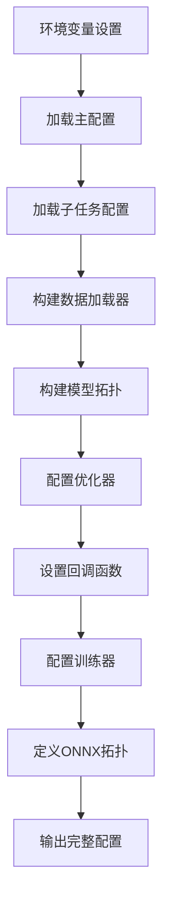

# projects/perception/entry.py 详细分析

## 📋 文件概览

[`projects/perception/entry.py`](../projects/perception/entry.py) 是LeapAI框架perception项目的主要入口配置文件，负责：
- 加载主配置文件
- 构建多任务数据加载器
- 配置模型拓扑结构
- 设置训练器和回调函数
- 定义完整的训练流程

## 🏗️ 整体架构



## 🔧 核心功能分析

### 1. 环境变量和配置加载

```python
# 第26行：加载主配置
MAIN_CFG = Config.fromfile(os.environ["LEAPAI_TASK_CONFIG"])

# 第27-29行：加载子任务配置
TASK_CFGS = {
    tn: Config.fromfile(c) for (tn, c) in MAIN_CFG.multi_task_config.items()
}
```

**关键环境变量**:
- `LEAPAI_TASK_CONFIG`: 主配置文件路径
- `RCNUM`: 机器数量
- `GPU_NUM`: 每台机器的GPU数量

### 2. 全局配置参数

```python
# 从主配置中提取关键参数
save_root = base.save_root
ckpt_dir = base.ckpt_dir
job_name = MAIN_CFG.job_name
max_steps = MAIN_CFG.max_steps
train_steps = MAIN_CFG.train_steps
finetune_steps = MAIN_CFG.finetune_steps
float_lr = MAIN_CFG.float_lr
finetune_lr = MAIN_CFG.finetune_lr
warmup_steps = MAIN_CFG.warmup_steps
```

**配置参数说明**:

| 参数 | 说明 | 用途 |
|------|------|------|
| `max_steps` | 最大训练步数 | 控制训练总长度 |
| `train_steps` | 训练阶段步数 | 第一阶段训练长度 |
| `finetune_steps` | 微调阶段步数 | 第二阶段微调长度 |
| `float_lr` | 预训练学习率 | 预训练阶段学习率 |
| `finetune_lr` | 微调学习率 | 微调阶段学习率 |
| `warmup_steps` | 预热步数 | 学习率预热步数 |

### 3. 多任务数据加载器构建

```python
# 第75-156行：为每个任务构建数据加载器
for task_name in MAIN_CFG.multi_task_config.keys():
    CFG = TASK_CFGS[task_name]
    
    # 构建训练数据加载器
    train_dataloader = dict(
        type=DataLoader,
        use_rank_split=True,
        mini_dataset_length=mini_dataset_length[task_name],
        dataset=train_dataset,
        batch_size=MAIN_CFG.batch_sizes[task_name]["train"],
        num_workers=MAIN_CFG.num_workers[task_name]["train"],
        collate_fn=partial(collate_func, ignore_keys=[...]),
        pin_memory=False,
        sampler=train_sampler,
        drop_last=True,
        persistent_workers=False,
    )
    
    # 构建验证数据加载器
    val_dataloader = dict(
        type=DataLoader,
        dataset=val_dataset,
        batch_size=1,
        num_workers=MAIN_CFG.num_workers[task_name]["val"],
        collate_fn=partial(collate_func, ignore_keys=[...]),
        sampler=None if use_video_codec else val_sampler,
        pin_memory=True,
        drop_last=False,
        persistent_workers=False,
    )
```

**数据加载器特点**:
- **多任务支持**: 每个任务有独立的数据加载器
- **灵活配置**: 支持不同的batch size和worker数量
- **内存优化**: 使用pin_memory和persistent_workers
- **数据融合**: 支持collate函数进行多模态数据融合

### 4. 模型拓扑构建

```python
# 第265-278行：构建任务拓扑
task_topologies = {}
for task_name in MAIN_CFG.multi_task_config.keys():
    task_topologies[task_name] = partial(
        topology_all_tasks,
        train_task_name=task_name,
        node_topologies=node_topologies,
    )
```

**拓扑结构**:
- **节点定义**: 每个任务定义自己的节点
- **拓扑函数**: 使用partial函数延迟执行
- **任务连接**: 通过node_topologies连接不同任务

### 5. 优化器配置

```python
# 第302-331行：配置优化器和学习率调度
opt_lr = float_lr if train_steps != 0 else finetune_lr
optimizer = base.get_optimizer("adamw", lr=opt_lr, wd=1e-2)

# 多阶段学习率调度
milestones, lr_list = base.get_mutistep_gamma_lr(
    multi_lr_milestones=dict(
        train=[0.65 * train_steps, 0.9 * train_steps],
        finetune=[0.65 * finetune_steps + train_steps, 0.9 * finetune_steps + train_steps],
    ),
    train_steps=train_steps,
    finetune_steps=finetune_steps,
    gamma=0.1,
    lr=dict(train=float_lr, finetune=finetune_lr),
)
```

**优化策略**:
- **分阶段训练**: 训练和微调使用不同学习率
- **学习率调度**: 多阶段milestone和gamma衰减
- **权重衰减**: AdamW优化器with 1e-2权重衰减

### 6. 回调函数配置

```python
# 第333-352行：配置各种回调函数
callbacks.append(base.lr_warmup_callback)
callbacks.append(base.grad_scale_callback)

# 冻结模块调度
if freeze_module_schedules:
    freeze_module_callback = dict(
        type="FreezeModule",
        interval_by=MAIN_CFG.interval_by,
        schedules=freeze_module_schedules,
    )
    callbacks.append(freeze_module_callback)

# 属性损失回调
if attr_start_train_step:
    add_attr_loss_callback = dict(
        type="AddAttrTrainLoss",
        interval_by=MAIN_CFG.interval_by,
        schedules=attr_start_train_step,
    )
    callbacks.append(add_attr_loss_callback)
```

**回调函数类型**:
- **学习率预热**: `lr_warmup_callback`
- **梯度缩放**: `grad_scale_callback`
- **模块冻结**: `FreezeModule`
- **属性损失**: `AddAttrTrainLoss`

### 7. NodeGraph模型构建

```python
# 第355-369行：构建图模型节点
graph_nodes = {}
graph_nodes.update(model_base.base_nodes)  # 基础节点

for task_name, nodes in task_nodes.items():
    if isinstance(nodes, nn.Module):
        graph_nodes[task_name] = nodes
    elif isinstance(nodes, dict):
        for sub_name, sub_node in nodes.items():
            if sub_name in graph_nodes:
                raise KeyError(f"node: {sub_name} has already existed.")
            graph_nodes[sub_name] = sub_node

# 第462-478行：构建图模型
graph_model = dict(
    type=NodeGraphModify,
    graph_nodes=graph_nodes,
    task_topologies=task_topologies,
    optimizer_cfg=optimizer,
    lr_scheduler_cfg=lr_scheduler,
    use_backbone_amp=use_backbone_amp,
    task_loss_weights=task_loss_weights,
    accumulate_grad_batches=accumulate_grad_batches,
    transfer_on_cuda=dict(
        train=task_train_transfer_on_cuda,
        val=task_val_transfer_on_cuda,
        test=task_val_transfer_on_cuda,
        onnx=task_val_transfer_on_cuda,
    ),
    onnx_topology=onnx_topology,
)
```

**图模型特点**:
- **节点管理**: 支持模块和字典形式的节点定义
- **拓扑连接**: 通过task_topologies定义节点连接关系
- **多任务支持**: 支持动态、静态、占用等多个任务
- **ONNX导出**: 内置ONNX拓扑导出功能

### 8. 训练器配置

```python
# 第566-607行：配置Lightning训练器
runner = dict(
    type=L.Trainer,
    accelerator=base.accelerator,
    strategy=base.strategy,
    devices=devices_id,
    num_nodes=num_machines,
    precision=precision,
    logger=base.loggers,
    callbacks=callbacks,
    fast_dev_run=False,
    max_epochs=None,
    min_epochs=None,
    max_steps=max_steps,
    min_steps=None,
    max_time=None,
    limit_train_batches=limit_train_batches,
    limit_val_batches=limit_val_batches,
    limit_test_batches=None,
    limit_predict_batches=None,
    overfit_batches=overfit_batches,
    val_check_interval=2 * max_steps + 1,
    check_val_every_n_epoch=None,
    num_sanity_val_steps=0,
    log_every_n_steps=log_every_n_steps,
    enable_checkpointing=True,
    enable_progress_bar=False,
    enable_model_summary=True,
    accumulate_grad_batches=1,
    gradient_clip_val=gradient_clip_val,
    gradient_clip_algorithm=gradient_clip_algorithm,
    deterministic=deterministic,
    benchmark=False,
    inference_mode=False,
    use_distributed_sampler=use_distributed_sampler,
    profiler=profiler,
    detect_anomaly=False,
    barebones=False,
    plugins=None,
    sync_batchnorm=False,
    reload_dataloaders_every_n_epochs=1,
    default_root_dir=None,
)
```

**训练器配置要点**:
- **分布式支持**: 支持多机多卡训练
- **精度控制**: 支持混合精度训练
- **检查点管理**: 自动保存和恢复训练
- **性能监控**: 内置profiler支持
- **调试模式**: 支持fast_dev_run和deterministic模式

### 9. ONNX导出拓扑

```python
# 第373-458行：ONNX导出拓扑定义
def onnx_topology(model: L.LightningModule, data_dict: dict, state: str):
    task_out = {}
    for cur_task in data_dict:
        outputs = {}
        common_data_dict = data_dict[cur_task]
        
        # 提取相机特征
        cam_feats = model_base.extract_camera_feat_onnx(model, common_data_dict)
        
        # 提取LiDAR特征
        if model_base.enable_lidar:
            lidar_feats = model_base.extract_lidar_feat(model, common_data_dict)
            fuser = getattr(model, "fuser")
        else:
            lidar_feats = None
            fuser = None
        
        # 视图变换
        view_transfer = getattr(model, "view_transfer")
        bev_feats = view_transfer.forward_onnx(
            mlvl_feats=cam_feats,
            lidar_feats=lidar_feats,
            fuser=fuser,
            sampling_locations_list=common_data_dict["reference_points_cam"],
        )
        
        # 处理占用网络特征
        sptial_feats, lidar_feats_occ = model_base.extract_lidar_feat_occ(model, common_data_dict)
        bev_feats.update({"occ": [sptial_feats, lidar_feats_occ]})
        
        # 执行任务拓扑
        for test_task_name, node_topo_fn in node_topologies.items():
            if test_task_name in model.task_names:
                task_output = node_topo_fn(
                    state, model, None, bev_feats[test_task_name],
                    query=query, reference_points_init=reference_points_init,
                    reference_points_sigmoid=reference_points_sigmoid,
                    prev_query=prev_query, prev_reference_points=prev_reference_points,
                    prev_feat_list=prev_feat_list, feature_warp_matrix=feature_warp_matrix,
                    metas=metas,
                )
                outputs.update(task_output)
        task_out[cur_task] = outputs
    return task_out
```

**ONNX导出特点**:
- **多模态融合**: 支持相机和LiDAR特征融合
- **时序处理**: 支持时序查询和参考点
- **占用网络**: 专门的占用网络特征处理
- **任务拓扑**: 复用训练时的拓扑结构

## 🎯 关键设计模式

### 1. 配置分层模式

```python
# 主配置 -> 子任务配置 -> 具体组件配置
MAIN_CFG = Config.fromfile(os.environ["LEAPAI_TASK_CONFIG"])
TASK_CFGS = {tn: Config.fromfile(c) for (tn, c) in MAIN_CFG.multi_task_config.items()}
```

**优势**:
- 配置复用和继承
- 模块化配置管理
- 灵活的任务组合

### 2. 延迟执行模式

```python
# 使用partial函数延迟执行拓扑
task_topologies[task_name] = partial(
    topology_all_tasks,
    train_task_name=task_name,
    node_topologies=node_topologies,
)
```

**优势**:
- 减少初始化开销
- 支持动态参数传递
- 提高代码复用性

### 3. 多任务数据融合模式

```python
# 合并多任务数据加载器
train_dataloaders = dict(
    type=CombinedLoader,
    iterables=task_train_dataloaders,
    mode="max_size_cycle",
)
```

**优势**:
- 统一的数据接口
- 灵活的采样策略
- 高效的数据利用

## 🔍 深入理解要点

### 1. 配置依赖关系

```
环境变量 -> 主配置文件 -> 子任务配置 -> 组件配置
    LEAPAI_TASK_CONFIG -> MAIN_CFG -> TASK_CFGS -> 组件参数
```

### 2. 多阶段训练策略

- **阶段1**: 预训练阶段（train_steps）
- **阶段2**: 微调阶段（finetune_steps）
- **学习率**: 不同阶段使用不同学习率
- **调度策略**: 多阶段milestone和gamma

### 3. 模块冻结机制

```python
freeze_module_schedules = {
    "stage1_backbone0": train_steps,
    "stage1_backbone1": train_steps,
    "stage1_backbone2": train_steps,
    "stage1_backbone3": train_steps,
    "stage1_neck0": train_steps,
    "stage1_neck1": train_steps,
    "stage1_neck2": train_steps,
    "stage1_neck3": train_steps,
    "view_transfer": train_steps,
}
```

**冻结策略**:
- 分阶段冻结不同模块
- 支持backbone和neck分层冻结
- 灵活的冻结时间点

### 4. 属性任务集成

```python
# 更新动态任务配置
if "dynamic" in TASK_CFGS and "attr_config" in MAIN_CFG:
    TASK_CFGS["dynamic"]["dynamic_head"]["loss_attr"].update(
        MAIN_CFG.attr_config["loss_attr"]
    )
    TASK_CFGS["dynamic"]["dynamic_head"]["only_train_attr"] = (
        MAIN_CFG.attr_config["only_train_attr"]
    )
```

**属性任务特点**:
- 动态属性检测
- 可配置的属性分支
- 灵活的损失函数组合

## 🛠️ 扩展和定制

### 1. 添加新任务

```python
# 1. 在主配置中添加任务
multi_task_config = {
    "existing_task": "path/to/config.py",
    "new_task": "path/to/new_config.py",
}

# 2. 在entry.py中添加任务处理
if "new_task" in MAIN_CFG.multi_task_config.keys():
    CFG = TASK_CFGS["new_task"]
    # 构建新任务的数据加载器和拓扑
```

### 2. 自定义回调函数

```python
# 添加自定义回调
custom_callback = dict(
    type="CustomCallback",
    custom_param=value,
)
callbacks.append(custom_callback)
```

### 3. 修改训练策略

```python
# 修改学习率调度
custom_lr_scheduler = base.get_lr_scheduler(
    "custom_scheduler",
    milestones=custom_milestones,
    lr_list=custom_lr_list,
)
```

## 📊 性能优化建议

### 1. 数据加载优化

```python
# 优化数据加载器
train_dataloader = dict(
    num_workers=8,  # 增加worker数量
    pin_memory=True,  # 固定内存
    persistent_workers=True,  # 保持worker进程
    prefetch_factor=2,  # 预取数据
)
```

### 2. 内存优化

```python
# 启用混合精度
precision = "16-mixed"  # 使用半精度训练

# 梯度累积
accumulate_grad_batches=2  # 累积2个梯度再更新
```

### 3. 分布式训练优化

```python
# 分布式配置
strategy="ddp"  # 使用DDP策略
sync_batchnorm=True  # 同步BatchNorm
```

## 📝 总结

`projects/perception/entry.py` 是LeapAI框架的核心配置文件，体现了以下设计理念：

### ✅ 优点
1. **高度模块化**: 配置、数据、模型、训练完全解耦
2. **多任务支持**: 原生支持多任务训练和推理
3. **灵活配置**: 支持复杂的配置继承和覆盖
4. **性能优化**: 内置多种性能优化策略
5. **扩展友好**: 易于添加新任务和自定义组件

### 🔧 核心机制
1. **分层配置**: 主配置->子任务配置->组件配置
2. **延迟执行**: 使用partial函数优化性能
3. **多阶段训练**: 支持预训练+微调的训练策略
4. **模块冻结**: 灵活的模块冻结和解冻机制
5. **ONNX导出**: 内置模型导出和部署支持

### 🎯 学习要点
1. **配置管理**: 理解复杂的配置依赖关系
2. **多任务架构**: 掌握多任务数据加载和模型构建
3. **训练策略**: 学习分阶段训练和优化技巧
4. **扩展方法**: 了解如何添加新任务和自定义组件
5. **性能调优**: 掌握各种性能优化策略

通过深入理解 `entry.py`，您可以更好地掌握LeapAI框架的配置和使用方法，为自动驾驶感知算法的开发提供强有力的支持。
