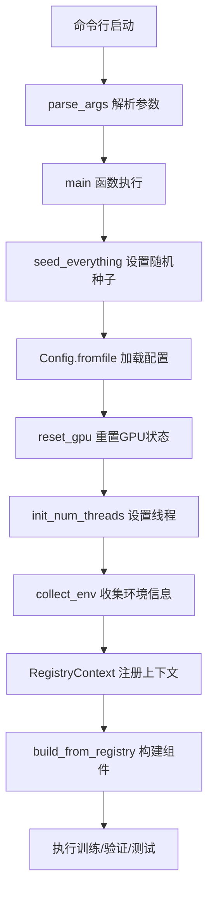

# tools/main.py 详细分析

## 📋 文件概览

[`tools/main.py`](../tools/main.py) 是LeapAI框架的统一入口点，负责处理命令行参数、初始化环境和执行训练流程。这个文件虽然只有97行代码，但是整个框架的核心枢纽。

## 🏗️ 整体架构



## 🔧 核心功能分析

### 1. 命令行参数解析 (`parse_args()`)

```python
def parse_args():
    """Add argument."""
    parser = argparse.ArgumentParser()
    parser.add_argument("--config", type=str, required=True)   # 主配置文件路径
    parser.add_argument("--state", type=str, required=True)  # 运行模式
    parser.add_argument("--with-val", action="store_true", default=False)  # 训练时是否验证
    parser.add_argument("--seed", type=int, default=0)
    parser.add_argument("--ckpt", type=str, default=None)  # 预训练权重
    parser.add_argument("--resume", type=str, default=None)  # 恢复训练
    parser.add_argument("--num-threads", type=str, default="12")  # CPU线程数
    parser.add_argument("--local-rank", type=int, default=0)  # 分布式训练rank
    parser.add_argument("--verbose", action="store_true", default=False)  # 详细输出
    return parser.parse_args()
```

**关键参数说明：**

| 参数 | 类型 | 必需 | 说明 | 示例 |
|------|------|------|------|------|
| `--config` | str | ✅ | 主配置文件路径 | `projects/perception/entry.py` |
| `--state` | str | ✅ | 运行模式 | `train/val/test/predict` |
| `--with-val` | flag | ❌ | 训练时是否启用验证 | `--with-val` |
| `--seed` | int | ❌ | 随机种子 | `42` |
| `--ckpt` | str | ❌ | 预训练权重路径 | `/path/to/checkpoint.ckpt` |
| `--resume` | str | ❌ | 恢复训练检查点 | `/path/to/resume.ckpt` |
| `--num-threads` | str | ❌ | CPU线程数 | `12` |
| `--local-rank` | int | ❌ | 分布式训练本地rank | `0` |
| `--verbose` | flag | ❌ | 详细输出模式 | `--verbose` |

### 2. 主执行流程 (`main()`)

#### 2.1 环境初始化阶段

```python
def main(args):
    """Entrance function."""
    seed_everything(args.seed)                    # 设置随机种子
    cfg_path = args.config                        # 获取配置文件路径
    cfg = Config.fromfile(cfg_path)              # 加载配置文件
    reset_gpu()                                   # 重置GPU状态
    ckpt = args.ckpt if args.ckpt else cfg.get("float_pretrain", None)
    resume_ckpt = args.resume if args.resume else cfg.get("resume_ckpt", None)
    init_num_threads(args.num_threads)            # 设置CPU线程数
```

**初始化步骤详解：**

1. **随机种子设置** (`seed_everything`)
   - 确保实验可重现性
   - 影响PyTorch、NumPy、Python random等所有随机数生成器

2. **配置文件加载** (`Config.fromfile`)
   - 支持Python配置文件
   - 自动解析配置继承和引用
   - 提供配置验证和默认值处理

3. **GPU状态重置** (`reset_gpu`)
   - 清理GPU内存
   - 重置CUDA上下文
   - 避免之前的训练残留影响

4. **检查点处理**
   - `ckpt`: 预训练模型权重
   - `resume_ckpt`: 恢复训练的完整状态（包括优化器状态等）

5. **CPU线程设置** (`init_num_threads`)
   - 控制PyTorch的CPU并行度
   - 优化数据加载和计算性能

#### 2.2 环境信息收集

```python
env_info_dict = collect_env()
env_info = "\n".join([(f"{k}: {v}") for k, v in env_info_dict.items()])
dash_line = "-" * 79 + "\n"
rank_zero_info(
    "Environment info:\n" + dash_line + env_info + "\n" + dash_line
)
```

**环境信息包括：**
- Python版本
- PyTorch版本
- CUDA版本
- GPU信息
- 系统信息
- 安装的包版本等

#### 2.3 组件构建和执行

```python
with RegistryContext():
    # 配置验证模式
    with_val = args.with_val
    runner_cfg = cfg.runner
    state = args.state
    
    # 训练模式特殊配置
    if state == "train" and not with_val:
        runner_cfg["num_sanity_val_steps"] = 0
        runner_cfg["limit_val_batches"] = 0
    
    # 验证模式特殊配置
    if state == "val":
        runner_cfg["val_check_interval"] = None
    
    # 构建核心组件
    runner = build_from_registry(runner_cfg)      # 构建训练器
    model = build_from_registry(cfg.graph_model)   # 构建模型
    data_module = build_from_registry(cfg.data_module)  # 构建数据模块
    
    # 加载预训练权重
    if ckpt:
        model = load_checkpoint(
            model, ckpt, allow_miss=True, allow_unexpect=True, verbose=args.verbose
        )
    
    # 执行不同模式
    if state == "val":
        runner.validate(model, data_module)
    elif state == "test":
        runner.test(model, data_module)
    elif state == "predict":
        runner.predict(model, data_module)
    elif state == "train":
        runner.fit(model=model, datamodule=data_module, ckpt_path=resume_ckpt)
    else:
        raise KeyError(f"Unknown state: {state}, only support `train,val,test`")
```

## 🎯 关键设计模式

### 1. 注册机制模式

```python
with RegistryContext():
    runner = build_from_registry(runner_cfg)
    model = build_from_registry(cfg.graph_model)
    data_module = build_from_registry(cfg.data_module)
```

**优势：**
- 组件解耦，易于扩展
- 配置驱动的组件构建
- 支持插件化架构

### 2. 配置驱动模式

所有组件都通过配置文件定义：
```python
cfg = Config.fromfile(cfg_path)
runner_cfg = cfg.runner
model_cfg = cfg.graph_model
data_cfg = cfg.data_module
```

### 3. 状态机模式

根据 `--state` 参数执行不同的操作：
- `train`: 训练模式
- `val`: 验证模式
- `test`: 测试模式
- `predict`: 预测模式

## 🚀 使用示例

### 1. 基础训练

```bash
python tools/main.py \
    --config projects/perception/entry.py \
    --state train \
    --with-val
```

### 2. 从预训练权重开始训练

```bash
python tools/main.py \
    --config projects/perception/entry.py \
    --state train \
    --ckpt /path/to/pretrain.ckpt \
    --with-val
```

### 3. 恢复训练

```bash
python tools/main.py \
    --config projects/perception/entry.py \
    --state train \
    --resume /path/to/checkpoint.ckpt \
    --with-val
```

### 4. 验证模式

```bash
python tools/main.py \
    --config projects/perception/entry.py \
    --state val \
    --ckpt /path/to/checkpoint.ckpt
```

### 5. 测试模式

```bash
python tools/main.py \
    --config projects/perception/entry.py \
    --state test \
    --ckpt /path/to/checkpoint.ckpt
```

### 6. 分布式训练

```bash
# 单机多卡
python -m torch.distributed.launch --nproc_per_node=4 \
    tools/main.py \
    --config projects/perception/entry.py \
    --state train \
    --with-val

# 多机多卡
python -m torch.distributed.launch \
    --nnodes=2 --node_rank=0 --master_addr="192.168.1.100" --master_port=1234 \
    --nproc_per_node=4 \
    tools/main.py \
    --config projects/perception/entry.py \
    --state train \
    --with-val
```

## 🔍 深入理解

### 1. RegistryContext 的作用

```python
with RegistryContext():
    # 在这个上下文中，所有注册的组件都可以被构建
    runner = build_from_registry(runner_cfg)
```

**RegistryContext 提供：**
- 组件注册的临时作用域
- 避免全局污染
- 支持组件的动态加载和卸载

### 2. build_from_registry 的工作原理

```python
def build_from_registry(cfg):
    # 根据配置中的 type 字段查找对应的注册类
    # 实例化类并传入配置参数
    # 返回构建好的组件实例
```

### 3. 配置文件的层次结构

```python
# entry.py
from leapai.utils.config import Config

cfg = Config.fromfile("configs/lpperception_current_hpa_step1.py")

# 配置包含：
# - runner: 训练器配置
# - graph_model: 模型配置  
# - data_module: 数据模块配置
# - 其他组件配置
```

## 🛠️ 扩展和定制

### 1. 添加新的运行模式

```python
# 在 main() 函数中添加新的状态处理
elif state == "export":
    # 模型导出模式
    runner.export(model, data_module, export_path=args.export_path)
elif state == "profile":
    # 性能分析模式
    runner.profile(model, data_module)
else:
    raise KeyError(f"Unknown state: {state}")
```

### 2. 自定义参数处理

```python
def parse_args():
    parser = argparse.ArgumentParser()
    # 现有参数...
    
    # 添加自定义参数
    parser.add_argument("--export-path", type=str, default=None)
    parser.add_argument("--profile-output", type=str, default=None)
    parser.add_argument("--custom-config", type=str, default=None)
    
    return parser.parse_args()
```

### 3. 环境变量支持

```python
def main(args):
    # 支持环境变量覆盖
    config_path = os.getenv("LEAPAI_CONFIG", args.config)
    state = os.getenv("LEAPAI_STATE", args.state)
    
    cfg = Config.fromfile(config_path)
    # ...
```

## 🔧 调试和故障排除

### 1. 常见错误和解决方案

#### 错误1：配置文件不存在
```
FileNotFoundError: [Errno 2] No such file or directory: 'config.py'
```
**解决方案：**
- 检查配置文件路径是否正确
- 使用绝对路径或相对路径
- 确保文件权限正确

#### 错误2：GPU内存不足
```
RuntimeError: CUDA out of memory
```
**解决方案：**
- 减少batch size
- 使用 `--num-threads` 调整CPU线程
- 检查GPU使用情况

#### 错误3：注册组件失败
```
KeyError: 'Unknown component type: xxx'
```
**解决方案：**
- 检查组件是否已正确注册
- 确认配置文件中的type字段正确
- 查看注册表是否包含所需组件

### 2. 调试技巧

#### 启用详细输出
```bash
python tools/main.py \
    --config projects/perception/entry.py \
    --state train \
    --verbose
```

#### 设置调试模式
```bash
export my_debug=yes
python tools/main.py \
    --config projects/perception/entry.py \
    --state train
```

#### 单步调试
```python
# 在 main() 函数中添加断点
import pdb; pdb.set_trace()
```

## 📊 性能优化

### 1. 内存优化

```python
# 在配置文件中设置
runner_cfg = {
    "precision": 16,  # 使用混合精度训练
    "accumulate_grad_batches": 2,  # 梯度累积
    "max_epochs": 100,
}
```

### 2. 数据加载优化

```python
data_module_cfg = {
    "num_workers": 8,  # 增加数据加载进程
    "pin_memory": True,  # 固定内存
    "persistent_workers": True,  # 保持工作进程
}
```

### 3. 分布式训练优化

```python
# 多机多卡训练
python -m torch.distributed.launch \
    --nnodes=2 \
    --node_rank=0 \
    --master_addr="192.168.1.100" \
    --master_port=1234 \
    --nproc_per_node=4 \
    tools/main.py \
    --config projects/perception/entry.py \
    --state train
```

## 🎯 最佳实践

### 1. 配置管理

```python
# 使用环境变量管理不同环境
if os.getenv("ENV") == "prod":
    cfg = Config.fromfile("configs/production.py")
elif os.getenv("ENV") == "dev":
    cfg = Config.fromfile("configs/development.py")
```

### 2. 实验管理

```python
# 自动生成实验名称
import datetime
exp_name = f"exp_{datetime.now().strftime('%Y%m%d_%H%M%S')}"
cfg.exp_name = exp_name
```

### 3. 检查点管理

```python
# 自动保存最佳模型
runner_cfg = {
    "callbacks": [
        {
            "type": "ModelCheckpoint",
            "monitor": "val_loss",
            "mode": "min",
            "save_top_k": 3,
            "filename": "{epoch}-{val_loss:.2f}",
        }
    ]
}
```

## 📝 总结

[`tools/main.py`](../tools/main.py) 是LeapAI框架的核心入口，它的设计体现了以下优秀特性：

### ✅ 优点
1. **简洁明了**: 97行代码实现了完整的训练流程
2. **配置驱动**: 所有组件都通过配置文件定义
3. **模式化**: 支持train/val/test/predict多种模式
4. **可扩展**: 易于添加新的运行模式和功能
5. **分布式友好**: 原生支持分布式训练
6. **调试友好**: 提供详细的日志和错误信息

### 🔧 核心机制
1. **注册机制**: 实现组件的动态构建和加载
2. **配置系统**: 支持复杂的配置继承和覆盖
3. **环境管理**: 自动处理GPU、线程等环境设置
4. **状态管理**: 清晰的状态机模式处理不同运行模式

### 🚀 使用建议
1. **熟悉参数**: 理解每个命令行参数的作用
2. **配置管理**: 合理组织配置文件结构
3. **环境设置**: 根据硬件配置优化参数
4. **调试技巧**: 善用verbose和debug模式
5. **扩展开发**: 基于现有模式添加新功能

通过深入理解 `tools/main.py`，您可以更好地掌握LeapAI框架的使用和扩展，为自动驾驶感知算法的开发提供强有力的支持。
