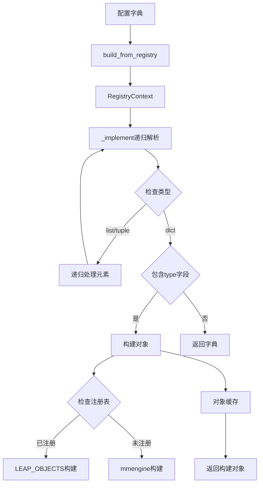

# leapai/registry.py 详细分析

## 📋 文件概览

`leapai/registry.py` 是LeapAI框架的核心注册机制文件，实现了基于配置的动态对象构建系统。该文件提供了完整的组件注册、构建和管理功能，是框架模块化架构的基础。

**文件路径**: [`leapai/registry.py`](../leapai/registry.py)  
**文件大小**: 158行  
**核心功能**: 对象注册、动态构建、递归解析  

## 🎯 设计目标

### 主要功能
1. **组件注册**: 提供统一的组件注册机制
2. **动态构建**: 基于配置字典动态构建对象
3. **递归解析**: 递归处理嵌套配置结构
4. **延迟构建**: 支持延迟构建和循环引用处理
5. **上下文管理**: 提供构建上下文和对象缓存

### 架构设计


## 🔧 核心组件分析

### 1. 导入和依赖 (第1-15行)

```python
import inspect
import os
import pkgutil
from importlib import import_module
from typing import Any, Union

from lightning.pytorch.utilities import CombinedLoader
from mmengine.registry import Registry, build_functions
from torch.utils.data import ConcatDataset, DataLoader, Dataset, Sampler

mm_build_from_cfg = build_functions.build_from_cfg

_default_registered = False

no_keep_class = (Dataset, DataLoader, ConcatDataset, CombinedLoader, Sampler)
```

#### 依赖分析
- **inspect**: 用于类型检查和反射
- **pkgutil**: 用于动态包导入
- **mmengine.Registry**: 基础注册机制
- **PyTorch数据类**: 数据集和数据加载器相关
- **no_keep_class**: 不缓存的类类型（数据相关类）

### 2. RegistryContext类 (第18-34行)

```python
class RegistryContext:
    """Store a mapping between object id and object instance."""

    _current: Union[dict, None] = None

    def __enter__(self):
        assert RegistryContext._current is None
        RegistryContext._current = {}
        return self

    def __exit__(self, ptype, value, trace):
        RegistryContext._current = None

    @classmethod
    def get_current(cls):
        return cls._current
```

#### 功能特点
- **上下文管理**: 使用上下文管理器模式
- **对象缓存**: 在构建过程中缓存对象实例
- **递归处理**: 防止循环引用导致的无限递归
- **线程安全**: 类级别的当前上下文

#### 使用模式
```python
# 基本使用
with RegistryContext():
    obj = build_from_registry(config)

# 嵌套使用（会抛出断言错误）
with RegistryContext():
    with RegistryContext():  # AssertionError
        obj = build_from_registry(config)
```

### 3. build_from_cfg函数 (第36-50行)

```python
def build_from_cfg(cfg: dict, registry: Registry, default_args: dict = None):
    if not isinstance(registry, Registry):
        raise TypeError(
            f"registry must be `mmengine.Registry` but got {type(registry)}"
        )
    if not isinstance(cfg, dict):
        raise TypeError(f"cfg must be `dict` but got {type(cfg)}")
    if "type" not in cfg:
        raise KeyError("cfg must have key `type`")

    global _default_registered
    if not _default_registered:
        registry_default_config()
        _default_registered = True
    return mm_build_from_cfg(cfg, registry, default_args)
```

#### 参数验证
- **registry类型检查**: 确保传入正确的Registry对象
- **cfg类型检查**: 确保配置是字典类型
- **type字段检查**: 确保配置包含type字段

#### 自动注册机制
- **延迟注册**: 首次调用时自动注册默认组件
- **全局状态**: 使用全局变量跟踪注册状态
- **一次性操作**: 避免重复注册

### 4. LEAP_OBJECTS注册表 (第53-58行)

```python
LEAP_OBJECTS = Registry(
    "leapai_objects",
    parent=None,
    scope="leapai",
    build_func=build_from_cfg,
)
```

#### 注册表特点
- **名称**: "leapai_objects"
- **作用域**: "leapai"
- **构建函数**: 使用自定义的build_from_cfg
- **无父注册表**: 独立的注册体系

### 5. 类型检查函数 (第61-65行)

```python
def is_target_type(obj_type, target):
    if isinstance(obj_type, str) and obj_type in LEAP_OBJECTS:
        obj_type = LEAP_OBJECTS.get(obj_type)
    assert inspect.isclass(obj_type)
    return issubclass(obj_type, target)
```

#### 功能
- **字符串转换**: 将字符串类型转换为实际类
- **类型验证**: 确保是类类型
- **继承检查**: 检查是否是目标类的子类

### 6. 手动导入函数 (第68-75行)

```python
def manual_import_lib(lib_dir):
    pre = os.path.basename(lib_dir)
    for _, name, _ in pkgutil.walk_packages([lib_dir], prefix=f"{pre}."):
        try:
            import_module(name)
        except Exception as e:
            filepath = os.path.join(*name.split("."))
            raise ImportError(f"import error {filepath}: {e}")
```

#### 导入机制
- **递归遍历**: 使用pkgutil.walk_packages递归遍历包
- **动态导入**: 使用import_module动态导入模块
- **错误处理**: 提供详细的错误信息
- **路径构建**: 将点分模块名转换为文件路径

### 7. 默认注册函数 (第78-83行)

```python
def registry_default_config():
    global _default_registered
    if _default_registered:
        return
    manual_import_lib(os.path.dirname(__file__))
    _default_registered = True
```

#### 注册策略
- **自注册**: 自动导入leapai包下的所有模块
- **单次执行**: 确保只注册一次
- **全局状态**: 使用全局变量跟踪注册状态

### 8. 数据集构建函数 (第86-94行)

```python
def build_concat_dataset(cfg):
    assert "datasets" in cfg
    datasets = cfg["datasets"]
    builded_set = []
    for set_cfg in datasets:
        obj = build_from_registry(set_cfg)
        builded_set.append(obj)
    concat = ConcatDataset(builded_set)
    return concat
```

#### 构建流程
1. **验证配置**: 确保包含datasets字段
2. **递归构建**: 逐个构建子数据集
3. **合并数据集**: 使用ConcatDataset合并
4. **返回结果**: 返回合并后的数据集

### 9. 核心实现函数 _implement (第97-140行)

```python
def _implement(x: Any):
    id2obj = RegistryContext.get_current()
    assert id2obj is not None
    if isinstance(x, (list, tuple)):
        x = type(x)([_implement(xi) for xi in x])
        return x
    elif isinstance(x, dict):
        if "_lazy_build" in x and x["_lazy_build"]:
            x.pop("_lazy_build")
            return x
        obj_id = id(x)
        has_type = "type" in x

        if has_type and obj_id in id2obj:
            return id2obj[obj_id]

        if x.pop("_recursion", True):
            build_obj = {}
            for key, value in x.items():
                build_obj[key] = _implement(value)
        else:
            build_obj = x
        x = build_obj

        if has_type:
            obj_type = x["type"]
            if isinstance(obj_type, str) and obj_type in LEAP_OBJECTS:
                obj_type = LEAP_OBJECTS.get(obj_type)
            isclass = inspect.isclass(obj_type)

            if isclass and issubclass(obj_type, ConcatDataset):
                obj = build_concat_dataset(x)
            else:
                obj = build_from_cfg(x, LEAP_OBJECTS)

            if isclass and issubclass(obj_type, no_keep_class):
                pass
            else:
                id2obj[obj_id] = obj
            return obj
        else:
            return x
    else:
        return x
```

#### 处理逻辑

##### 1. 列表/元组处理
```python
if isinstance(x, (list, tuple)):
    x = type(x)([_implement(xi) for xi in x])
    return x
```
- **递归处理**: 对每个元素递归调用_implement
- **类型保持**: 保持原始容器类型

##### 2. 延迟构建处理
```python
if "_lazy_build" in x and x["_lazy_build"]:
    x.pop("_lazy_build")
    return x
```
- **延迟标记**: 遇到_lazy_build标记时直接返回
- **标记清理**: 移除_lazy_build字段

##### 3. 对象缓存机制
```python
obj_id = id(x)
has_type = "type" in x

if has_type and obj_id in id2obj:
    return id2obj[obj_id]
```
- **ID缓存**: 使用对象ID作为缓存键
- **循环引用**: 防止循环引用导致的无限递归

##### 4. 递归控制
```python
if x.pop("_recursion", True):
    build_obj = {}
    for key, value in x.items():
        build_obj[key] = _implement(value)
else:
    build_obj = x
```
- **递归开关**: 控制是否递归处理子元素
- **默认递归**: 默认开启递归处理

##### 5. 对象构建
```python
if has_type:
    obj_type = x["type"]
    if isinstance(obj_type, str) and obj_type in LEAP_OBJECTS:
        obj_type = LEAP_OBJECTS.get(obj_type)
    isclass = inspect.isclass(obj_type)

    if isclass and issubclass(obj_type, ConcatDataset):
        obj = build_concat_dataset(x)
    else:
        obj = build_from_cfg(x, LEAP_OBJECTS)
```
- **类型解析**: 解析字符串类型为实际类
- **特殊处理**: ConcatDataset特殊处理
- **通用构建**: 使用注册表构建对象

##### 6. 缓存策略
```python
if isclass and issubclass(obj_type, no_keep_class):
    pass
else:
    id2obj[obj_id] = obj
```
- **排除缓存**: 数据相关类不缓存
- **普通缓存**: 其他对象正常缓存

### 10. 主入口函数 (第143-158行)

```python
def build_from_registry(x: Any):
    """Build object from registered.

    This function will recursively visit all elements and build it if it is a
    dict containing key `type`.
    """
    global _default_registered
    if not _default_registered:
        registry_default_config()
        _default_registered = True
    current = RegistryContext.get_current()
    if current is None:
        with RegistryContext():
            return _implement(x)
    else:
        return _implement(x)
```

#### 功能特点
- **自动注册**: 确保默认组件已注册
- **上下文管理**: 自动管理构建上下文
- **递归构建**: 递归处理嵌套配置
- **统一入口**: 提供统一的构建接口

## 🎯 关键设计模式

### 1. 注册表模式
```python
LEAP_OBJECTS = Registry(
    "leapai_objects",
    parent=None,
    scope="leapai",
    build_func=build_from_cfg,
)
```
- **统一注册**: 所有组件通过统一注册表管理
- **作用域隔离**: 通过scope避免命名冲突
- **自定义构建**: 使用自定义构建函数

### 2. 上下文管理模式
```python
class RegistryContext:
    def __enter__(self):
        assert RegistryContext._current is None
        RegistryContext._current = {}
        return self

    def __exit__(self, ptype, value, trace):
        RegistryContext._current = None
```
- **资源管理**: 自动管理构建上下文
- **状态控制**: 防止嵌套使用
- **清理保证**: 确保上下文正确清理

### 3. 递归构建模式
```python
def _implement(x: Any):
    if isinstance(x, (list, tuple)):
        return type(x)([_implement(xi) for xi in x])
    elif isinstance(x, dict):
        # 递归处理字典
        for key, value in x.items():
            build_obj[key] = _implement(value)
```
- **深度优先**: 递归处理所有嵌套结构
- **类型保持**: 保持原始数据结构类型
- **智能构建**: 只构建包含type字段的字典

### 4. 延迟构建模式
```python
if "_lazy_build" in x and x["_lazy_build"]:
    x.pop("_lazy_build")
    return x
```
- **按需构建**: 支持延迟构建标记
- **性能优化**: 避免不必要的对象创建
- **灵活控制**: 提供构建时机控制

## 📊 使用示例

### 1. 基本对象构建
```python
config = {
    "type": "SomeClass",
    "param1": "value1",
    "param2": "value2"
}

obj = build_from_registry(config)
```

### 2. 嵌套配置构建
```python
config = {
    "type": "MainClass",
    "sub_obj": {
        "type": "SubClass",
        "param": "value"
    },
    "list_param": [
        {
            "type": "ListItemClass",
            "item_param": "item_value"
        }
    ]
}

obj = build_from_registry(config)
```

### 3. 延迟构建
```python
config = {
    "type": "MainClass",
    "lazy_obj": {
        "_lazy_build": True,
        "type": "LazyClass",
        "param": "value"
    }
}

obj = build_from_registry(config)
# obj.lazy_obj 仍然是字典，未构建
```

### 4. 数据集构建
```python
config = {
    "type": "ConcatDataset",
    "datasets": [
        {"type": "Dataset1", "param1": "value1"},
        {"type": "Dataset2", "param2": "value2"}
    ]
}

dataset = build_from_registry(config)
```

## 🔧 扩展机制

### 1. 组件注册
```python
# 在模块中注册组件
from leapai.registry import LEAP_OBJECTS

@LEAP_OBJECTS.register_module()
class MyComponent:
    def __init__(self, param1, param2):
        self.param1 = param1
        self.param2 = param2
```

### 2. 自定义构建函数
```python
def custom_build_func(cfg, registry, default_args=None):
    # 自定义构建逻辑
    pass

LEAP_OBJECTS = Registry(
    "custom_objects",
    build_func=custom_build_func,
)
```

### 3. 延迟构建控制
```python
config = {
    "type": "MyClass",
    "sub_obj": {
        "_recursion": False,  # 禁用递归构建
        "type": "SubClass",
        "nested": {
            "type": "NestedClass"
        }
    }
}
```

## 🎯 核心优势

### 1. 灵活性
- **配置驱动**: 通过配置文件控制对象构建
- **动态加载**: 运行时动态加载和构建对象
- **嵌套支持**: 支持任意深度的嵌套配置

### 2. 可扩展性
- **插件架构**: 通过注册机制支持插件扩展
- **自动发现**: 自动导入和注册组件
- **统一接口**: 提供统一的构建接口

### 3. 性能优化
- **对象缓存**: 避免重复构建相同对象
- **延迟构建**: 支持按需构建减少开销
- **循环检测**: 防止无限递归

### 4. 错误处理
- **类型检查**: 严格的类型验证
- **详细错误**: 提供清晰的错误信息
- **异常传播**: 保持异常堆栈信息

## 📝 最佳实践

### 1. 组件设计
```python
@LEAP_OBJECTS.register_module()
class MyComponent:
    def __init__(self, param1="default", param2=None):
        self.param1 = param1
        self.param2 = param2
    
    def __call__(self, *args, **kwargs):
        # 实现组件逻辑
        pass
```

### 2. 配置设计
```python
config = {
    "type": "MyComponent",
    "param1": "custom_value",
    # 避免在配置中包含复杂对象
}
```

### 3. 错误处理
```python
try:
    obj = build_from_registry(config)
except TypeError as e:
    print(f"配置类型错误: {e}")
except KeyError as e:
    print(f"配置缺少字段: {e}")
except ImportError as e:
    print(f"模块导入错误: {e}")
```

## 🎉 总结

`leapai/registry.py` 是LeapAI框架的核心基础设施，提供了完整的组件注册和动态构建机制。它具有以下特点：

### ✅ 核心功能
1. **统一注册**: 提供统一的组件注册机制
2. **动态构建**: 基于配置动态构建对象
3. **递归解析**: 支持嵌套配置的递归处理
4. **延迟构建**: 支持延迟构建和性能优化
5. **上下文管理**: 提供构建上下文和对象缓存

### 🔧 设计优势
1. **高度灵活**: 配置驱动的对象构建
2. **易于扩展**: 插件化的组件架构
3. **性能优化**: 对象缓存和延迟构建
4. **错误友好**: 详细的错误信息和类型检查
5. **循环安全**: 防止循环引用导致的无限递归

### 📚 学习价值
通过深入理解registry.py，可以掌握：
- 工业级注册机制的设计和实现
- 动态对象构建的技术原理
- 递归配置解析的处理方法
- 上下文管理模式的实际应用
- 性能优化和错误处理的最佳实践

这个注册系统为LeapAI框架的模块化架构提供了坚实的基础，是理解框架设计理念的重要入口。
